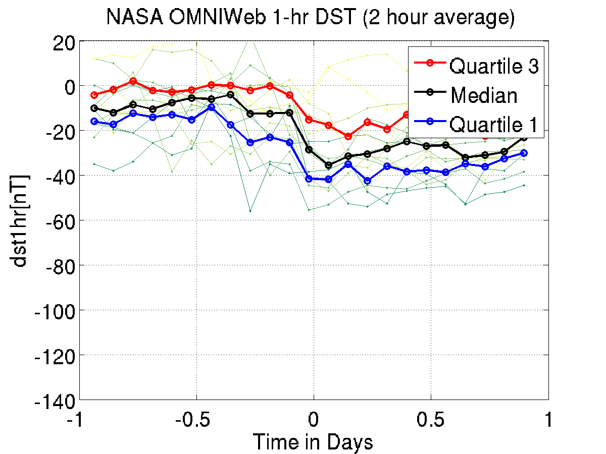
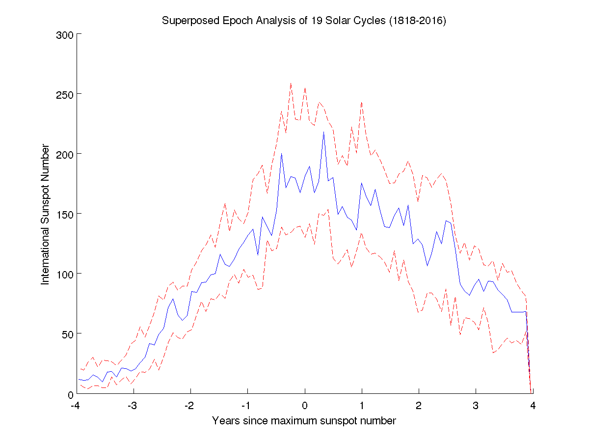

# Superposed Epoch Analysis in MATLAB


> In this superposed epoch plot, I am showing the reponse of the Disturbance Storm Time index to Coronal Mass Ejections (CMEs) hitting
> the earth's magnetic field. The DST measures the strength of the ring current, and is a proxy for the overall geomagnetic activity.
> The green lines each represent an individual storm, and the red, black, and blue lines are the statistical response

## What is superposed epoch analysis?
Superposed epoch analysis, also called _compositing_, 
is a technique for analyzing data that consists of measurements of the state of some observable system over time, 
i.e. a _timeseries_. More specifically, timeseries data in which some type of event repeatedly reoccurs.

## An example
For a simple example from space science, we can consider the eleven year solar cycle, as measured by the sunspot number:


While the activity of the sun waxes and wanes every eleven years, there are stronger and weaker cycles. 
Let's say that we want to develop a simple model to solar forcasters predict the average sunspot number and the range 
we would expect for any given point in future solar cycles. This is a perfect use case for the superposed epoch analysis.

## Step zero: get ready
The first tasks in any superposed epoch analysis are to obtain and import your timeseries data.
Without data, there is no analysis!

I got the data here:
[Sunspot number data as a CSV (comma seperated variable) file](http://www.sidc.be/silso/INFO/sndtotcsv.php)
But it comes as part of the git repository.

Now we must import the data into MATLAB. If you want to follow along, replace the path to the 
data (`/home/liamk/mirror/Projects/superposedepoch_tutorial/`) with where you cloned or unzipped the git repository
on your computer.

```{matlab}
sunspot_data = importdata('/home/liamk/mirror/Projects/superposedepoch_tutorial/SN_d_tot_V2.0.csv');
```
We will need to understand what is in our data
From SIDC website:
>  Contents:
>  Column 1: Year
>  Column 2: Month
>  Column 3: Day
>  Column 4: Date in fraction of year.
>  Column 5: Daily total sunspot number. A value of -1 indicates that no number is available for that day (missing value).
>  Column 6: Daily standard deviation of the input sunspot numbers from individual stations.
>  Column 7: Number of observations used to compute the daily value.
>  Column 8: Definitive/provisional indicator. '1' indicates that the value is definitive. '0' indicates that the value is still provisional.

It's usually easier to work with time as a single, monotonically increasing number, rather than having to think about
how many days are in each month, etc,etc, so it's nice that the data provides us with column 4: "date in fraction of year".
Let's define that as our time variable, and then use the data from column 5 for our analysis.

```{matlab}
time = sunspot_data(:,4);
ssn = sunspot_data(:,5);
```

Next we should take care of those pesky missing values. If you leave them in there, they can really mess things up. 
We'll just cut them out of the data entirely.

```{matlab}
missing = ssn == -1;
time = time(~missing);
ssn = ssn(~missing);
```

Now we can really begin.

## Step 1: Identify the events

Superposed epoch analysis (SEA) is all about _events_, which we can define as reoccurances of some type of cyclical or episodic process.
Basically, SEA is appropriate for analyzing anything that happens which has a beginning, middle, and end,
and plays out similarly over time each time it happens.

Examples of cyclical processes from earth sciences include our solar cycle example, or temperatures at a particular
weather station in Canada during the rise and fall of the El Nino. Episodic processes
could include hurricanes passing by a particular observation station in the Pacific ocean, or earthquakes from a particular fault,
which are observed by a particular siesmometer station, or coronal mass ejections hitting the earth's magnetosphere, as observed by ACE, 
the upstream solar wind monitor spacecraft.

In order to identify specific events, we have to define a single time as the quantitative 'center' of the event, so we can
tell the beginning of the event apart from the middle and end, and compare the beginnings of different events with eachother,
as opposed to the beginning of one event with the end of another, etc. In this way we can get a picture of how the process
plays out over time for a 'typical' event.

Our events will be individual solar cycles. We will use the maximum sunspot number for each solar cycle as our center time (sometimes called the zero epoch time)

I'll give the code for the center times, but I looked them up for the nearest month on [wikipedia](https://en.wikipedia.org/wiki/List_of_solar_cycles)

```{matlab}
solar_cycle_max_times = [1829+11/12,1837+3/12,1848+2/12,1860+2/12,1870+8/12,1883+12/12,...
1894+1/12,1906+2/12,1917+8/12,1928+4/12,1937+4/12,1947+5/12,...
1958+3/12,1958+3/12,1968+11/12,1979+12/12,1989+7/12,2000+3/12,2014+4/12];

%Since we don't know if the actual max was nearer the beginning or the end of the month,
%subtract half a month to put the center time in the middle of the specified month
solar_cycle_max_times = solar_cycle_max_times-1/24;
```
Note that these are in fractions of the year, the same as our sunspot observation times. Convenient!

Since we want to analyze the respose of a typical event, we need to pick an amount of time before and after the
zero epoch time in which we think we will see something interesting. Since the shortest solar cycle on our list
is about 9 years, it should be safe to do +- 4 years around our zero epoch time.

```{matlab}
%Loop through each solar cycle, or 'event'
for m = 1:length(solar_cycle_max_times)
  this_solar_cycle_max_time = solar_cycle_max_times(m);
  this_solar_cycle_times = time > this_solar_cycle_max_time-4 & time < this_solar_cycle_max_time+4;
  %More code goes here later
end
```

## Step 2: Bin the data into time bins relative to the zero epoch time

If we want to know what the sunspot number 1 year before the maximum is on average, and how that differs from 2 years before,
we need to divide each event into discrete time bins, so that the times for event 1 line up with exactly with the times for
event 2, etc. This makes the rest of the process a lot easier because the results can be stored in 
a [number of events x number of time bins] matrix

```{matlab}
n_days_per_bin = 30; %Approx month long bins
nbins = floor(365.25*8/n_days_per_bin);
time_bin_edges = linspace(-4,4,nbins+1);

n_solar_cycles = length(solar_cycle_max_times);

%Preallocate an array in which we will store our final results
%each row will represent a solar cycle, each column, a time bin
ssn_by_event = zeros(n_solar_cycles,nbins);

%Loop through events, and bin sunspot number data into time bins, and assign into
%the results array

for m = 1:n_solar_cycles
  this_solar_cycle_max_time = solar_cycle_max_times(m); 
  
  %Create variables for sunspot number observations for just this solar cycle, with 0 epoch time being
  %the sunspot maximum
  this_solar_cycle_times = time > this_solar_cycle_max_time-4 & time < this_solar_cycle_max_time+4;
  this_epoch_time = time(this_solar_cycle_times)-this_solar_cycle_max_time;
  this_ssn = ssn(this_solar_cycle_times);
  
  for t = 1:nbins-1
    in_bin_t = this_epoch_time >= time_bins(t) & this_epoch_time < time_bins(t+1);
    ssn_by_event(m,t) = mean(this_ssn(in_bin_t));
  end
  
end
```

## Step 3: Compute statistics about the data in each time bin

Now that we have the data all nicely arranged in a matrix `ssn_by_event`, where 
each row represents one of the solar cycles, and each column one of the time bins,
we can use matlab's median and quantile functions to get the average sunspot number
across all of the solar cycles for each time bin.

```{matlab}
%Take the median of each column, to represent the average response for that
%time bin, also take the 25th and 75th percentiles of each column, to
%represent the spread in sunspot numbers for that time bin
time_bin_centers = (time_bin_edges(1:end-1)+time_bin_edges(2:end))/2;
average_ssn = nanmedian(ssn_by_event,1); %The 1 means to take the median for each column, not each row
first_quartile_ssn = quantile(ssn_by_event,.25,1);
third_quartile_ssn = quantile(ssn_by_event,.75,1);
```

## Step 4: Plot your results and figure out what they are telling you

```{matlab}
%Plot the results
f = figure();
a = axes(); hold(a,'on');
plot(a,time_bin_centers,average_ssn,'b-');
plot(a,time_bin_centers,first_quartile_ssn,'r--');
plot(a,time_bin_centers,third_quartile_ssn,'r--');
xlabel('Years since maximum sunspot number');
ylabel('International Sunspot Number');
title(sprintf('Superposed Epoch Analysis of %d Solar Cycles (%d-%d)',n_solar_cycles,...
    floor(time(1)),floor(time(end))));
print(f,'-dpng','sunspot_number_sea.png');
```


Here we can see the results! The interpretation is an exercise for the reader, for now ;)

## Appendix: An alternate technique without time binning

Many people will skip the time binning step and just try to line up the data for each 
event by depending on the fact that the data comes in on a regular cadence (in the case of our sunspot data, 
this is one value for each day). In this case, you can simply define each event as +- 1461
values from the data array around the index of the value at the zero epoch time:

```{matlab}
%Loop through each solar cycle, or 'event'
for m = 1:length(solar_cycle_max_times)
  this_solar_cycle_max_time = solar_cycle_max_times(m);
  
  %Assumes that time is sorted in ascending order (usually true)
  closest_ssn_index_to_max_time = find(time>this_solar_cycle_max_time,1); 
  
  %4 years in days = 365.25*4=1461
  ssns_in_this_event = ssn(closest_ssn_index_to_max_time-1461:closest_ssn_index_to_max_time+1461);
  
  %More code goes here later
end
```

This works fine, as long as there are no large chunks of missing data and you really can depend
on the fact that the n-th point in the data array is for day n, and the n+1-th poin is for day n+1,
or whatever is the appropriate time step for your dataset.

